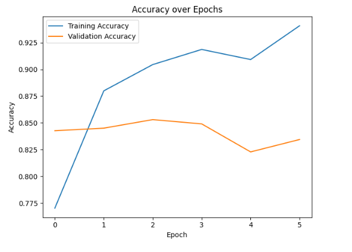
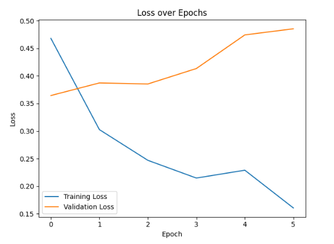
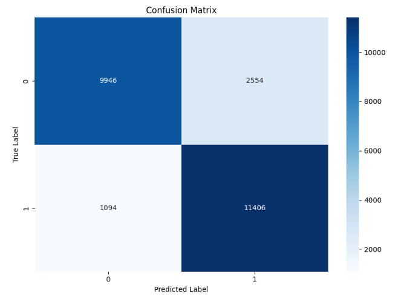
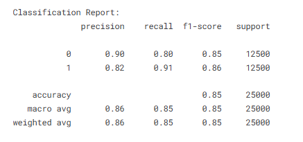

# 🧠 Recurrent Neural Networks (RNN) for Sentiment Analysis with IMDB

[](https://www.python.org/)
[](https://www.tensorflow.org/)
[](https://scikit-learn.org/stable/)
[](LICENSE)
[](https://www.kaggle.com/code/evangelosgakias/rnn-sentiment-analysis-tensorflow)

---

## 📈 Live Results

You can view the notebook with all outputs and results on Kaggle:  
[https://www.kaggle.com/code/evangelosgakias/rnn-sentiment-analysis-tensorflow](https://www.kaggle.com/code/evangelosgakias/rnn-sentiment-analysis-tensorflow)

---

## 📑 Table of Contents

- [Overview](#-overview)
- [Project Structure](#-project-structure)
- [Features](#-features)
- [Usage](#-usage)
- [Results](#-results)
- [Sample Visualizations](#-sample-visualizations)
- [Future Improvements](#-future-improvements)
- [Contributing](#-contributing)
- [License](#-license)
- [Contact](#-contact)

---

## 📋 Overview

This project demonstrates how to build, train, and evaluate a Recurrent Neural Network (RNN) using Long Short-Term Memory (LSTM) layers for sentiment analysis on the IMDB movie reviews dataset. The implementation leverages TensorFlow and Keras to construct a deep learning model that learns to classify movie reviews as positive or negative based on their text content.

The IMDB dataset consists of 50,000 movie reviews, split evenly into 25,000 training and 25,000 test samples, each labeled as positive or negative sentiment.

## 🏗️ Project Structure

```
.
├── RNN.ipynb               # Jupyter notebook with the complete implementation
├── README.md               # Project documentation (this file)
├── requirements.txt        # Python dependencies
├── .gitignore              # Specifies intentionally untracked files to ignore
├── LICENSE                 # MIT License file
└── figures/                # Screenshots and result images for the README (not tracked by git)
```

## 🚀 Features

### Data Preparation
- **Dataset Loading**: Automatic download and loading of the IMDB dataset
- **Preprocessing**:
  - Tokenization and integer encoding of reviews
  - Padding/truncating sequences to a fixed length
  - Train/validation/test split

### Model Architecture
- **Embedding Layer**: Learns dense vector representations for words
- **Bidirectional LSTM Layer**: Captures temporal dependencies in both directions
- **Dropout Layer**: Regularization to prevent overfitting
- **Dense Layers**: Fully connected layers for classification
- **Output Layer**: Sigmoid activation for binary sentiment classification

### Training Process
- **Optimizer**: Adam with learning rate 0.0005
- **Loss Function**: Binary Cross-Entropy
- **Callbacks**:
  - Early Stopping: Halts training when validation loss stops improving
  - Model Checkpoint: Saves the best model based on validation accuracy

### Evaluation & Visualization
- **Metrics**: Accuracy, Loss, Precision, Recall, F1-Score
- **Visualizations**:
  - Training/Validation accuracy and loss curves
  - Confusion matrix
  - Classification report
  - Random review prediction example

## 🚦 Usage

### Local Setup

1. **Clone the repository from GitHub:**
   ```bash
   git clone https://github.com/EvanGks/rnn-sentiment-analysis-imdb.git
   cd rnn-sentiment-analysis-imdb
   ```

2. **Create and activate a virtual environment:**

   **On Windows:**
   ```bash
   python -m venv .venv
   .venv\Scripts\activate
   ```
   **On macOS/Linux:**
   ```bash
   python3 -m venv .venv
   source .venv/bin/activate
   ```

3. **Install dependencies:**
   ```bash
   pip install -r requirements.txt
   ```

4. **Open the Jupyter Notebook:**
   ```bash
   jupyter notebook RNN.ipynb
   ```
   Or run directly on Kaggle:
   [](https://www.kaggle.com/code/evangelosgakias/rnn-sentiment-analysis-tensorflow)

5. **Run the notebook cells in order:**
   - The notebook is organized in a sequential manner
   - Each section is well-documented with explanations
   - All visualizations will be displayed inline

## 📊 Results

The model achieves the following performance (as shown in the [Kaggle notebook](https://www.kaggle.com/code/evangelosgakias/rnn-sentiment-analysis-tensorflow)):

| Metric              | Score    |
|---------------------|----------|
| Training Accuracy   | ~93%     |
| Validation Accuracy | ~86%     |
| Test Accuracy       | ~86%     |
| Test Loss           | ~0.35    |
| Precision           | ~86%     |
| Recall              | ~86%     |
| F1-Score            | ~86%     |

- **Test Accuracy:** ~86%
- **Test Loss:** ~0.35
- **Validation Accuracy:** ~86%
- **Training Accuracy:** ~93%
- **Classification Report:**
  - Precision, recall, and F1-score for both classes are balanced, indicating robust performance.
  - For full details and confusion matrix, see the [Kaggle notebook results](https://www.kaggle.com/code/evangelosgakias/rnn-sentiment-analysis-tensorflow).

> **Note:** All metrics, plots, and outputs are available in the linked Kaggle notebook for full transparency and reproducibility.

## 🖼️ Sample Visualizations

Below are key visualizations from the [Kaggle notebook](https://www.kaggle.com/code/evangelosgakias/rnn-sentiment-analysis-tensorflow). All images are available in the `figures/` directory (not tracked by git).

**Training and validation accuracy curves for the RNN on IMDB.**  
_Figure 1: Training and validation accuracy curves. The model shows strong learning and generalization, with validation accuracy closely tracking training accuracy._  


**Training and validation loss curves for the RNN on IMDB.**  
_Figure 2: Training and validation loss curves. The model converges well, with validation loss slightly higher than training loss, indicating minimal overfitting._  


**Confusion matrix for IMDB test set predictions.**  
_Figure 3: Confusion matrix for test set predictions. Most values are concentrated along the diagonal, indicating good accuracy across both sentiment classes._  


**Classification report for IMDB test set predictions, showing precision, recall, and f1-score for each class.**  
_Figure 4: Classification report for test set predictions. Both classes have precision, recall, and f1-score around 0.86, indicating balanced performance._  


> _Note: For a random review prediction example and more details, see the [Kaggle notebook](https://www.kaggle.com/code/evangelosgakias/rnn-sentiment-analysis-tensorflow)._

## 🛠️ Future Improvements

- Experiment with different RNN architectures (e.g., GRU, deeper or stacked LSTMs)
- Use pre-trained word embeddings (e.g., GloVe, Word2Vec)
- Incorporate attention mechanisms
- Perform further hyperparameter tuning (embedding size, LSTM units, dropout rates)
- Add more advanced regularization techniques
- Explore transfer learning for NLP

## 🤝 Contributing

Contributions are welcome! Please feel free to submit a Pull Request. For major changes, please open an issue first to discuss what you would like to change.

## 📝 License

This project is licensed under the MIT License - see the [LICENSE](LICENSE) file for details.

## 📧 Contact

For questions or feedback, please reach out via:

- **X (Twitter):** [@Evan6471133782](https://x.com/Evan6471133782)
- **LinkedIn:** [Evangelos Gakias](https://www.linkedin.com/in/evangelos-gakias-346a9072)
- **Email:** [vgakias_@hotmail.com](mailto:vgakias_@hotmail.com)

Or open an issue in the repository.

---
Happy Coding! 🚀